# Light and Shadows. Pack of shaders and scene setup examples.

Required Defold 1.10.3 version.
Also, to run with other versions of the editor, you must update the Spine extension dependency to the correct version.

## What is this?
A pack of materials and shaders to make a game with realtime shadow from one source (the sun) and a lot of point light sources.
The main difference from previous examples (see on the Defold forum) is the projection of the shadow map to the center of the screen (cast shadows follow the camera). So you can create a game world of any size. And the sprites/spine models get shadows from other objects as well as 3D models.

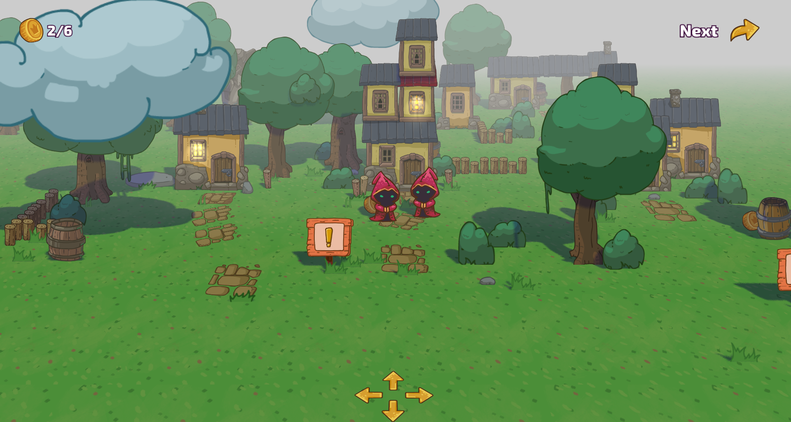

[Html5 demo](https://dragosha.com/defold/Light_and_Shadows/)

- Press and hold left mouse button to move the camera.
- Click on coins to collect them.
- Works on mobile as well.

## Setup

> [!NOTE]
> Make sure that you updated the 'Spine extension' dependence to [actual version](https://github.com/defold/extension-spine/releases) before open the project in Defold editor. To make this: open `game.project` file in any text editor and change the path `dependencies#.. = https://github.com/defold/extension-spine/archive/refs/tags/3.9.5.zip` depending on the version of your Defold editor.
> Also you may remove this dependence from your project at all. It's is not a part of the `light and shadows` and can be excluded from the project without any effect. Spine animation is using in a collection `examples\example4`.

> [!TIP]
> You can link this library as a dependency in your project and replace the renderer in your project settings. Or you can add the whole folder to your project. For something more than “just trying it out” I would recommend copying the library to your project, though, because you're likely to want to add your own customizations to shaders, new materials, etc.

### Render
The demo project is fully configured, if you want to configure your project from scratch see this section.

Set the render file in `bootstrap` section of the game.project.
Of course, you can use your own render script. Just add some elements to it.
Add `shadow` material to the list of materials available from render script, and shadowmap.render_target.
See `light_and_shadows/render/default.render` as the reference.

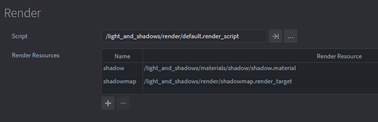

Add to render_script a few special lines of code. Its marked as `-- L_S Injection` in the reference render script.

---
    173 local light_and_shadows = require "light_and_shadows.light_and_shadows"
    ...
    init() method:
    178 add example and shadow predicates
    198 add light_and_shadows.init(self)
    ..
    update() method:
    213 add light_and_shadows.update(self)
    227 draw_options_world.constants = self.constants
    231 upscale injection
    242 render.enable_texture("tex1"...
    267 render.disable_texture("tex1")
    277 upscale ...
    

Add `shadow` to predicates list.
See `light_and_shadows/render/default.render_script` as the reference.

Tune shadow settings in the `light_and_shadows.lua` file.

You may create the shadowmap render target as code or as resource file (See `/light_and_shadows/render/shadowmap.render_target`)
Most important is:

* `BUFFER_RESOLUTION` = 2048 - Size of the shadow map texture. Select value from: 1024/2048/4096. More is better quality. Shadow map texture is projected to the game world.

* `PROJECTION_RESOLUTION` = 400 - This constant indicates the size of the area on which the shadow is projected around the screen center. Smaller size is better shadow quality. This value also depends on camera zoom / world scale. Feel free to adjust it. You can set it in the sun.script.

## Materials

### Model 

materials to setup the 3D models.

* `model_world` uses world vertex space. If you use 3D models with this material and the same texture, such objects will be assembled in batching. But this required more CPU time. Also this material can used for animated models.

* `model_local` uses local vertex space. Less CPU load, but each individual model will require its own drawcall.

* `model_instanced` uses local vertex space and 'mtx_world' and 'mtx_normal' are specified as attributes. This type is best suited for identical models duplicated in large numbers on a scene. Such as trees, walls, grass, etc. The geometry of such a model will be passed to the GPU once.

### Mesh 

material to install on the mesh component. Very similar to the material for models, but also uses the vertex color value in calculating the pixel totals.

### Sprite

* `light_sprite` - material to install on the sprite component. Since the sprite has no normals, we set the normal in the material as an user vector4 constant.
Note, the direction of the normal can and should be changed depending on what angle you set the sprites in your scene. In the example all sprites are tilted at the same X angle as the camera (-26.6), this is done to minimize distortion when drawing a scene with perspective, so that the sprites "look" exactly at the camera.

* `light_sprite_back` - uses the same shaders as light_sprite, but the normal in the material looks "up". Used for decals on the ground, for the floor, etc. Also drawn in its predicate, before the other sprites.

* `billboard_light_sprite` - The billboard sprite always faces the camera. If the scale of your sprite is not 1, you can set its scale manually in the sprite properties panel. Or use a special script `billboard.script`. Just add it to the game object with the sprite. 

> [!IMPORTANT]
> billboarding will only work correctly if the default sprite rotation is zero. See `_uncommon_objects` in /examples/example2/scene.collection as an example of how to use this feature.

* `bg_parallax_sprite` - Special sprite type. You can use it for background images by setting the coefficient with which this sprite will follow the camera. Values from 0 to 1 are set in the sprite properties panel for XYZ. 0.0 - the sprite is completely stationary in this dimension, i.e. it behaves like a normal sprite without adding camera coordinates. 1.0 - the sprite follows the camera.See `_uncommon_objects` in /examples/example2/scene.collection as an example of how to use this feature.

> [!NOTE]
> Parallax sprites do not apply dynamic lighting to themselves and do not cast shadows. They do, however, take into account ambient values and sunlight intensity. As well as fog. With such sprites you can fix a distant landscape on the background by moving the main game scene in front of it. The position of such a sprite is considered directly in the shader.

* `repeat_sprite_nocast` - A sprite with a repeating (tiled) texture. It is used for repeating the texture on a large area, for example, for filling the surface with grass, water surface (can be animated). In the rendering is drawn before the rest of the sprite to be under the feet of the character in any case. The normal in the material looks "up".
More info: [Texture repeat shader](https://github.com/Dragosha/defold-sprite-repeat)

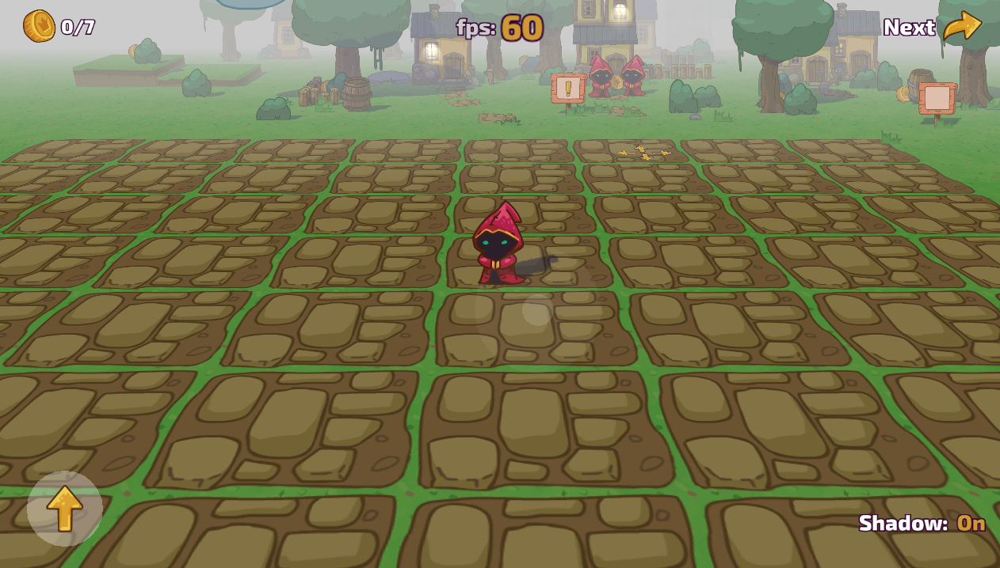

### Tilemap

> [!TIP]
> In fact, tilemaps use the same shaders as sprites. You can use any sprite material to set on a tilemap. You may need to create your own material to give it its own tag for rendering below or above the regular sprites.

### Spine

material to install on the spine component. Uses the same shaders as light_sprite, differs from sprite only by using a different view matrix.

### Fog 
* `fog_sprite`, `fog_particle`, `fog_label` are used on appropriate components when we do not need to calculate light and shadows. But the component must fade in the distance and calculate fog. For example, it is used for partials of fire, or the effect of glow from a window. Which is done simply by a sprite with a blending like `ADD` installed. Explore the example scene to understand better. 

### Hidden

materials for auxiliary objects that are not involved in the rendering, but should be visible in the editor window. For example, labels or a camera model.

### Shadow 

a special material for calculating the shadow map, set automatically in the render script.

> [!NOTE]
> Note that the materials that draw the shadows contain two samplers. Tex0 is your texture or atlas in the case of a sprite. Tex1 will be set automatically in the render script, it is a shadow map texture.

#### Tags:

Tag `shadow` marks that this object should cast a shadow. The render script will automatically substitute material for the object when it draws the shadow into the shadow map texture.

### Render constants

In addition to the data about the light sources, their position in the world and their color, only four additional constants are passed to the render script and then to the shaders.
These are: 

* `Clear color` or background color.

* `Fog color`. Usually the same as the clear color. 4th component (.w) is the fog density (0 - 1.0). Where 0 is a very high density.

* `Fog` minimum and maximum. Z-coord in the camera view space where the fog is started.

* `Ambient` color. 4th component (ambient.w) used as the maximum value of final color component at each pixels. In fragment shader it looks like

---
    diffuse_light = clamp(diffuse_light, 0.0, ambient.w);
    final_pixel_color = texture_color * diffuse_light;

All constants are in `constants.lua` module.

### Light setting

There is a special script and module with functions to setup initial render constants and manage the list of light sources during runtime in update function. This script sets constants into `constants.lua` module.

Your scene should contains one `light_setting.script`. In the example collection you can find it in the `root` game object.

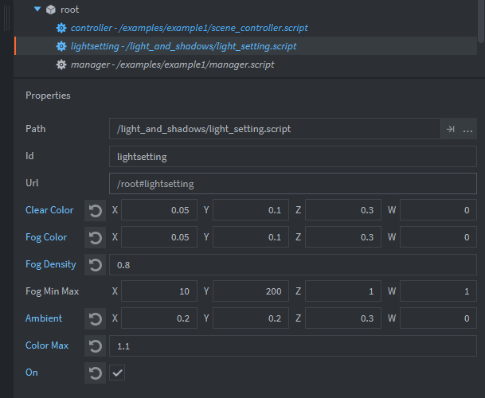

* `Clear color` or background color. R, G, B (0 - 1.0)

* `Fog color`. Usually the same as the clear color.

* `Fog density` (0 - 1.0). Where 0 is a very high density.

* `Fog Min Max` - minimum and maximum of Z-coord in the camera view space where the fog is started.

* `Ambient` color. R, G, B (0 - 1.0). This is an additional color added after blend all light sources. Among other things, it allows you to illuminate places that are in the shadows.

* `Color max` uses as the maximum value of final color component at each pixels. If the value > 1.0, the places where light sources overlap each other may have an excessive value.

You may include several 'light_setting' scripts with different settings for the testing purposes, but only one should be enabled by trigg `on` property.

## Sun

Only one light source casts shadows and this part is about him. There is a special script to setup initial render constants for the direct light source. Use ready to go prop "sun.go" from light_and_shadows/props folder. Or you can set this constants direct in the `constants.lua` file.

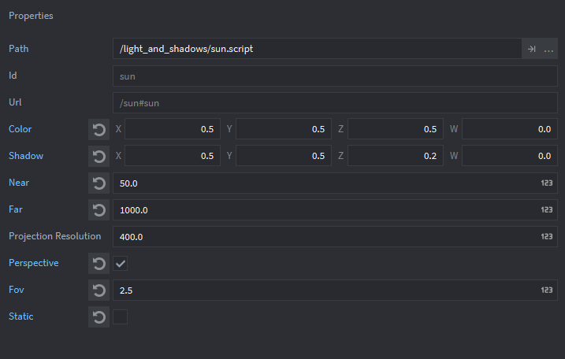

* `Color` of the light source. R, G, B (0 - 1.0). 

* `Shadow` - Inverted shadow color. Essentially these values are subtracted when the shader mixes the light from different sources. If you want to make the shadow more bluish, as artists do in daylight, make the B component slightly smaller than the others.

* `Near` - position of the near clipping plane to cast shadow (distance from the sun along relative z)

* `Far` - position of the far clipping plane to cast shadow (distance from the sun along relative z)

* `Projection Resolution` - This constant indicates the size of the area on which the shadow is projected around the screen center. Smaller size is better shadow quality. This value also depends on camera zoom / world scale. Feel free to adjust it. Note: only relevant for orthographic projection (default).

* `Perspective` - Enable perspective projection for shadow casting. Experimental function, gliches in shadow casting may occur. The direction of shadow casting is determined by the direction (rotation) of the sun object. Keep in mind that this mode is not an analogue of shadows from a point light source, as it directs its rays only in one direction (plane), not in six, as is necessary for a full-fledged point light source. However, with the help of scene adjustment it is quite possible to achieve an acceptable result, for example, to fill one room with light and shadow.

* `Fov` - field of view of the lens, measured as the angle in radians between the right and left edge. (Optimal value must be < 3.14)

* `Static` - The object is static and does not update its properties every frame.

* `Depth bias` - To reduce the Peter Panning effect (shadows detaching from objects) in shadow mapping, you need to adjust the shadow bias, a value that offsets the shadow depth. Too high a bias causes Peter Panning, while too low a bias leads to shadow acne.

To set the optimal Fov, Near and Far values for perspective projection, you can add a standard camera component to the scene in a `sun' object and adjust these values there, visually contrasting the area where shadows will be cast, then remove the camera from the scene.

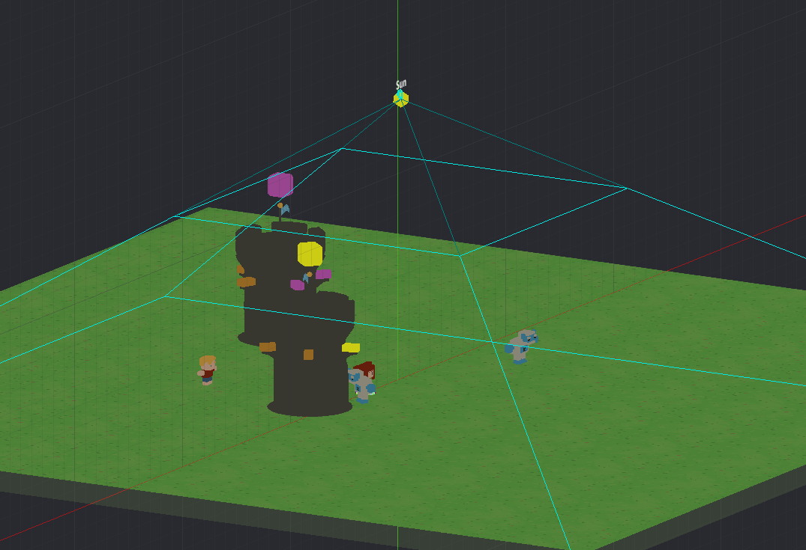

Note that color mixing from different light sources takes into account the normal to the surface of the object, be it a sprite or a 3D model.

## Scale of objects

Since this is a pure 3D scene, we prefer to use a scale 1 meter to 1 unit (pixel) in the editor. This means that you can place a collade 3D models as is. Also such object scale is very useful for enabling the 'Move Whole Pixel' option in the 'Edit' menu of the editor. But on the other hand, you need to scale all sprites/spine models to a scale of 0.06 or something like that.

## Bulb

To add a new light source to the scene you need to place bulb.script into the game object. Or use ready to go prop "bulb.go" from light_and_shadows/props folder.

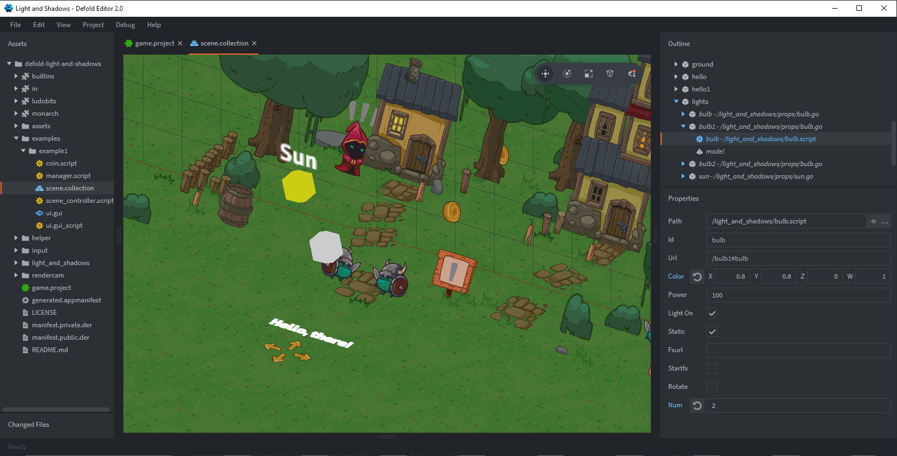

* `Color` of the light source. Red, Green, Blue. 
You may use a negative values as well as values more than 1.0 for override final color of pixel when all light sources are blending. 
* `Power` of the light source where 100 is normal 100 Watt bulb (just for reference, it's not exact).
* `Static`. The light source can move around the game world. The position of the source is calculated in the lights manager script. To make a lamp dynamic, just set `static` to false. Otherwise leave `static` set to 'true' for better performance.
* `Light on`. Turn on|off this bulb.
* `Direct` for spotlight. On | off. The direction of rotation of the bulb game object is used as the direction where this light source will shine.
* `Angle` is cone size for the shader calculations. In degrees.
* `Smoothness` - how softly you want to blur the edges of the cone. From 0.0 (soft) to 1.0 (hard).
* `Static_spot` - do you need to change spotlight direction in runtime? If 'true' the direction being calculation once for performance reason.
* `Num`. If the bulb has a positive number, this light source does not participate in sorting by distance from the center of the screen. It is always visible. Of course, if the number of all bulbs is less than the MAX values of the light sources (16 in this demonstration). The default value is -1. These bulbs are sorted in the light manager script and you can add as many bulbs as you want. But only the first 16 (this is the value you can change) will get into the shader.
* Also you may auto start particle FX attached to this game object and referenced in 'fxurl'.
* `Rotate` set to true is this object need to follow the camera rotating (works as Bilboard).

This example uses 8 simultaneously calculated light sources in the scene. If you need to change this number of light sources, you must change it in 'light_and_shadows.lua' and in the `/light_and_shadows/materials/fun.glsl` file.
Change the size of the arrays here:

---
    #define LIGHT_COUNT 8
                        ^^

If you don't want to use light sources at all and you have enough ambient light from the "sun" you can optimize the fragment shaders by excluding the calculation of light sources from them. Just comment the line ` #define USE_DIFFUSE_LIGHT` in `/light_and_shadows/materials/fun.glsl` file.

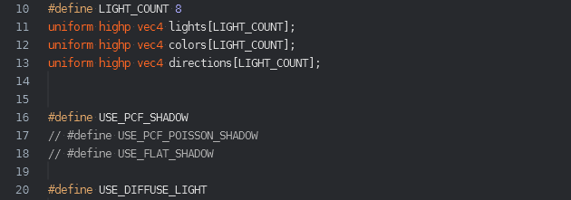

## Shadow's quality.

This bundle contains three variants of shadow in the fragment shader program.
You can choose one of them by uncomment #define in `/light_and_shadows/materials/fun.glsl` shader file and comment others variants.

---
    #define USE_PCF_SHADOW
    // #define USE_PCF_POISSON_SHADOW
    // #define USE_FLAT_SHADOW

### USE_PCF_SHADOW. Standart quality.

Uses 3 reads (samplers) from the shadowmap texture + randomization UV.

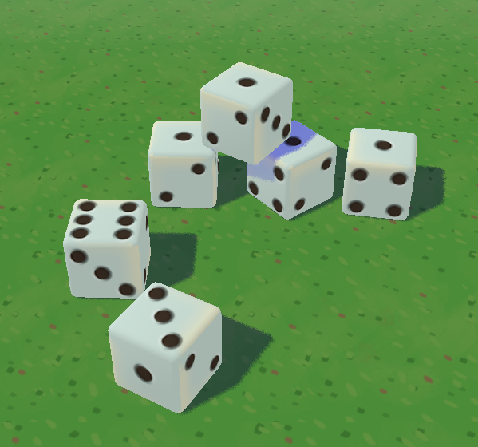

### USE_PCF_POISSON_SHADOW. Good quality.

Uses 8 sampler reads and Poisson filter + randomization UV.

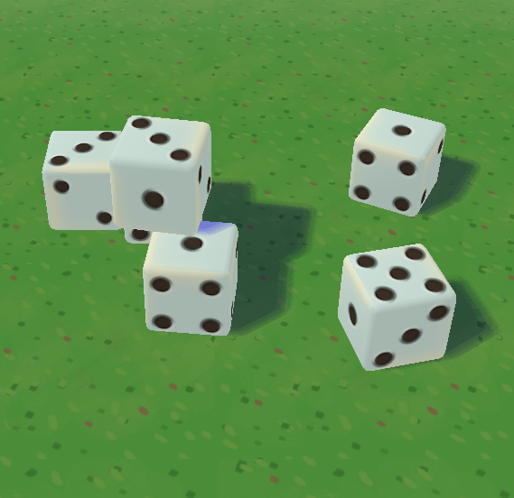

### USE_FLAT_SHADOW. Low quality.

Uses 1 sampler. Very simple variant.

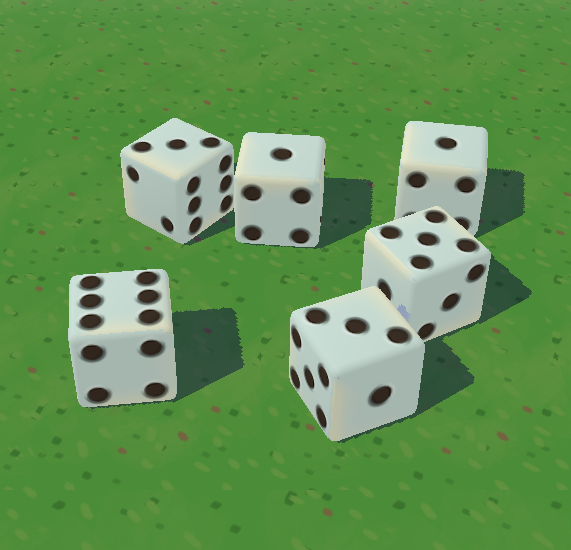

## Shadow casting on | off

To enable shadow casting set `light_and_shadows.shadow` as `true` in `/light_and_shadows/light_and_shadows.lua` file. Default value is true.

## Upscaling

In some cases a useful rendering technique where your scene is rendered at a low resolution and then stretched to the screen. Can help to get acceptable FPS on slow devices with large physical screen resolution. 
To enable set `light_and_shadows.upscale` as `true` in `/light_and_shadows/light_and_shadows.lua` file. If ‘on’ all the objects are first rendered to a render target with a size no larger than specified in the project settings, then this entire render target is placed on the screen with `linear` scaling.
Also to use this method you should add `/light_and_shadows/props/render_target_quad.go` game object to the main scene.

The final rendered target will be copied to the screen with a simple `copy` material, you can replace it with your own or, for example, use some post-processing effects.

Default value is false.

## Blur

You can enable blurring of the game scene canvas and draw an unblurred GUI on top of it. To do this, set the `light_and_shadows.blur` variable to **true**.
You can adjust the blur power by changing the `light_and_shadows.blur_power` value in the range from 1 to 10 (actually any, say 3.5 gives quite nice blur result as on the picture below).
Enabled blur automatically enables *Upscaling* as it uses the same Render Target.

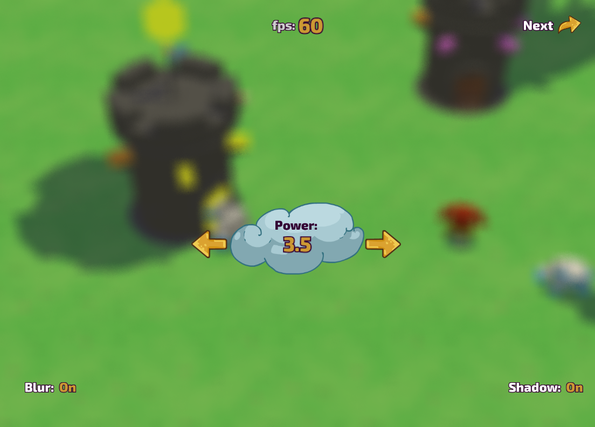

## One more thing

In addition to the light scene, this example contains supporting scripts that I often use in my projects. All of them are located in the helper folder. There you can find a script for moving an object with the mouse or touch, you can move the camera, light source or any other object. A set of common methods, such as playing sound with positioning. Or `simple_input` which is described in detail here: https://github.com/Dragosha/defold-things/blob/master/helpers/simple_input.md

If you're new to Defold, notice how the coin collection example works, how the scripts communicate with each other without using hardcoded binding. The `broadcast` module from the `ludobits` library is extremely useful!

## Happy Defolding!

## Credits

* Textures by Dragosha (https://dragosha.com/adventure-tileset/)
* `ludobits`, `monarch`, `defold-input` by Björn Ritzl
