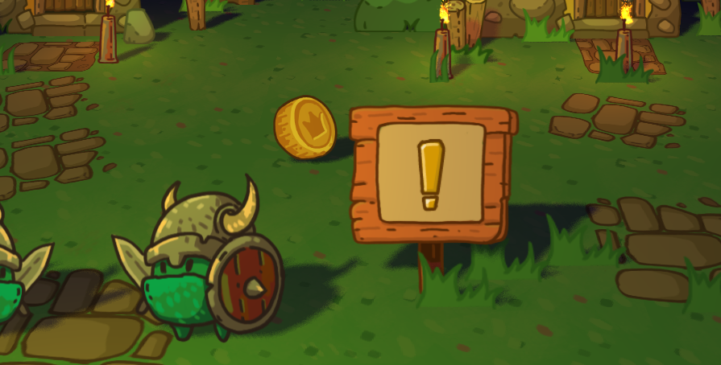
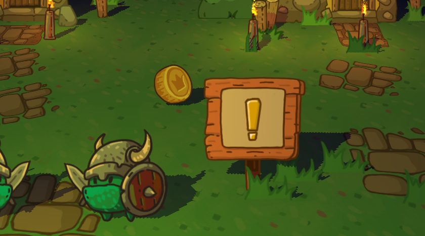
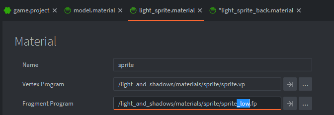

# Light and Shadows. Pack of shaders and scene setup examples.

Required 1.3.6 Defold version.

## What is this?
A pack of materials and shaders to make a game with realtime shadow from one source (the sun) and a lot of point light sources.
The main difference from previous examples (see on the Defold forum) is the projection of the shadow map to the center of the screen (cast shadows follow the camera). So you can create a game world of any size. And the sprites/spine models get shadows from other objects as well as 3D models.

[Html5 demo](https://dragosha.com/defold/Light_and_Shadows/)

- Press and hold left mouse button to move the camera.
- Click on coins to collect them.
- Works on mobile as well.

## Scene setup
...

## Scale of objects

Since this is a pure 3D scene, we prefer to use a scale 1 meter to 1 unit (pixel) in the editor. This means that you can place a collade 3D models as is. Also such object scale is very useful for enabling the 'Move Whole Pixel' option in the 'Edit' menu of the editor. But on the other hand, you need to scale all sprites/spine models to a scale of 0.06 or something like that.

## Bulb

To add a new light source to the scene you need to place bulb.script into the game object. Or use ready to go prop "bulb.go" from light_and_shadows/props folder.

* `Color` of the light source. Red, Green, Blue. 
You may use a negative values as well as values more than 1.0 for override final color of pixel when all light sources are blending. 
* `Power` of the light source where 100 is normal 100 Watt bulb (just for reference, it's not exact).
* Also you may auto start particle FX attached to this game object and referenced in 'fxurl'.
* `Rotate` set to true is this object need to follow the camera rotating (works as Bilboard).

* The light source can move around the game world. The position of the source is calculated in the lights manager script. To make a lamp dynamic, just set `static` to false. Otherwise leave `static` set to 'true' for better performance.

* `Num`. If the bulb has a positive number, this light source does not participate in sorting by distance from the center of the screen. It is always visible. Of course, if the number of all bulbs is less than the MAX values of the light sources (16 in this demonstration). The default value is -1. These bulbs are sorted in the light manager script and you can add as many bulbs as you want. But only the first 16 (this is the value you can change) will get into the shader.

This example uses 16 simultaneously calculated light sources in the scene. If you need to change this number of light sources, you must change it in 'light_and_shadows.lua' and in the fragment shaders.
In the fragment shaders (.fp) change the size of the arrays here:

---
    uniform highp vec4 lights[16];
    uniform highp vec4 colors[16];
                              ^^
    for (int i = 0; i < 16; ++i) {
                        ^^

## Shadow's quality.

This bundle contains two variants the fragment shaders. 
Standart quality:

Uses 9 reads (samplers) from the shadowmap texture + randomization UV. May be too slow for using on lowend mobile devices.

Low quality:

Uses 1 sampler. Very simple variant.
This shader also uses a short version of diffuse light function. Without the specular calculation.

To switch the quality you need to change fragment shader in used materials (model, light_sprite, light_sprite_back). 

## Happy Defolding!

## Credits

* `RenderCam` camera implementation by Ross Grams
* Textures by Dragosha (https://dragosha.com/free/adventure-tileset.html)
* `ludobits`, `monarch`, `defold-input` dependencies by Björn Ritzl
